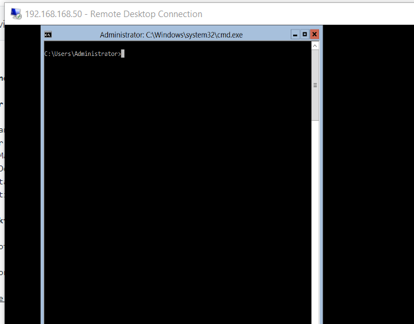

## Installation

### 1. Install Windows 2012 Core as usual

### 2. Change your environment

Using sconfig, change some parameter here:
a. Change computer name
b. Enable Remote Management
c. Enable Remote Desktop with any client version
d. Change IP to static
e. Change date / time


### 3. Remote Desktop your new server :

Before we can remote desktop to our server, we need to change some parameters.
	
Enable Firewall for remote desktop

[Some prerequisite / guidance](https://docs.microsoft.com/en-us/archive/blogs/bruce_adamczak/windows-2012-core-survival-guide-remote-desktop)

```sh
PS C:\Users\Administrator> Enable-NetFirewallRule -DisplayGroup "Remote Desktop"
```

Now we can manage our server using remote desktop



<Aside> 
Firewall is something we don't talk here. My environment is local LAN with no access to the internet
</Aside>

### 4. Install Windows Admin on your Windows 10 Laptop
- **Download it here**:

(https://www.microsoft.com/en-us/evalcenter/evaluate-windows-admin-center)
	
- **Manage it Here** :
	(https://docs.microsoft.com/en-us/windows-server/manage/windows-admin-center/deploy/install)
	
- **If you having problem with TrustedHosts** :
	(https://docs.microsoft.com/en-us/windows-server/manage/windows-admin-center/support/troubleshooting#configure-trustedhosts)

### 5. Add new server to your Windows Admin
a. On our laptop, Add new server to our laptop "hosts" file

- 192.168.0.50 vm-server2012

b. On the new server, change some parameter:

- Preparation here :
	(https://docs.microsoft.com/en-us/windows-server/manage/windows-admin-center/deploy/prepare-environment#prepare-windows-server-2012-and-2012-r2)
- Enable WinRM with powershell :

- Powershell command

```
Enable-PSRemoting -Force
```

- Enable File and Printer Sharing with powershell :

- Powershell command

```
Enable-NetFirewallRule -DisplayGroup "File and Printer Sharing"
```

- Install WMF version 5.1 or higher :
	- Prepare here : 
		(https://docs.microsoft.com/en-us/powershell/scripting/windows-powershell/wmf/setup/install-configure?view=powershell-7.1)
	- Download here : 
		(https://go.microsoft.com/fwlink/?linkid=839516)
	- Copy your downloaded file to your server
	- Install it via remote desktop

c. Select your server, then choose "manage as" and fill it with your username / password
